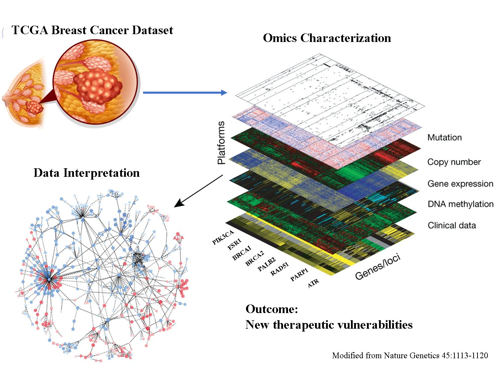
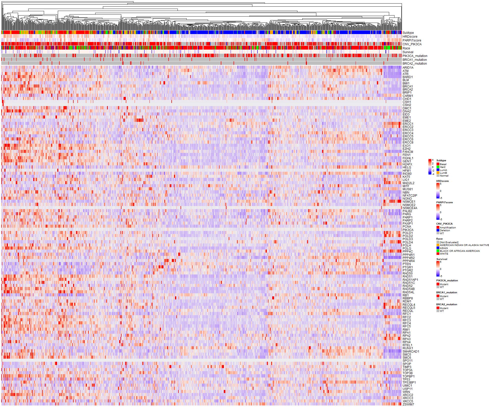
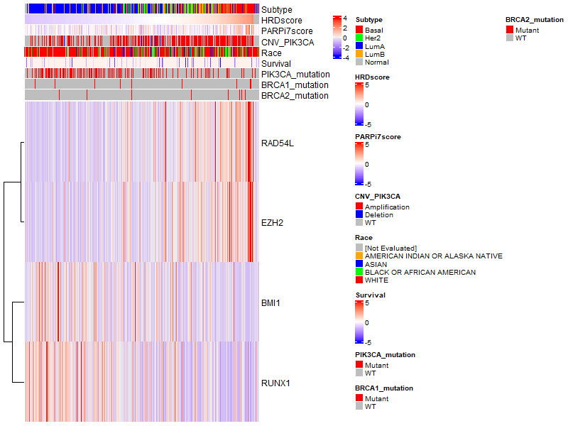
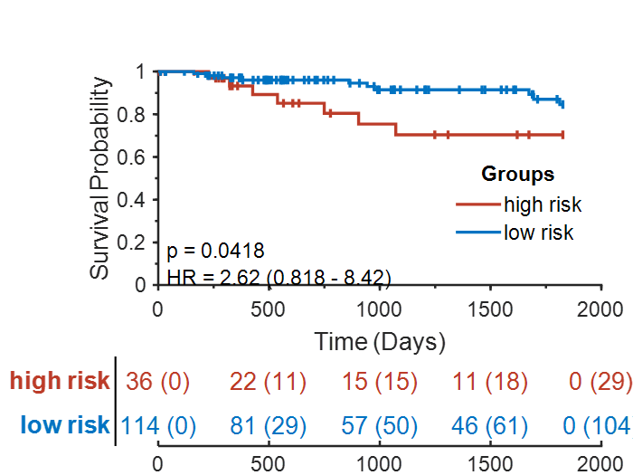

# Biology and Therapeutic Vulnerability in PIK3CA Mutated Breast Cancer

## Overview

The historical approach to treating cancer has been characterized by
one-size-fits-all treatments such as radiation therapy and chemotherapy
with limited success. These methods have significant repercussions for
healthy cells and unacceptable efficacy. Since cancer is a highly
heterogeneous and patient-specific disease, the novel approach provided
by precision oncology has risen in popularity for its ability to negate
the disadvantages of these methods through the use of select medicine
for each patient. Precision oncology offers individualized treatment of
cancer on a per-patient basis, based on the unique DNA fingerprint of a
patient\'s cancer. New, advanced technologies for DNA/RNA sequencing
have led to rapid advancement on developing novel therapies.

Breast cancers are associated with the highest mortality rate of any
cancer, and more than 70% are hormone-receptor (HR) positive and human
epidermal growth factor receptor 2 (HER2) negative (Katsura et al.,
2022; Setiawan et al., 2009). Approximately 40% of patients with
HR-positive, HER2-negative breast cancer have activating mutations in
the gene *PIK3CA*, such as the hyperactivation of the alpha isoform
(p110$\alpha$) of phosphatidylinositol 3-kinase (PI3K) (Cancer Genome
Atlas Network, 2012).

Zeng et al. demonstrated that the PIK3CA pH1047R hotspot mutation is
more frequent in proliferative disease without atypia (PDWA) compared to
non-proliferative disease. This suggests that PIK3CA mutation can also
be observed in non-cancerous breast tissue, and thus additional genomic
aberrations are required for a cell with PIK3CA mutation to become
cancerous.

The phosphatidylinositol 3-kinase (PI3K)/protein kinase B
(AKT)/mammalian target of rapamycin (mTOR) is a signaling pathway
involved in cell proliferation, survival, apoptosis, and DNA repair
(Miricescu et al., 2020). DNA damage repair (DDR) plays a vital role in
retaining the genomic stability of cells by repairing all types of DNA
damage, such as base excision repair (BER), nucleotide excision repair
(NER), mismatch repair (MMR), homologous recombination repair (HRR), and
non-homologous end joining (NHEJ). DNA double-strand breaks (DDB) are
the most severe type of DNA damage and can be repaired by HRR and NHEJ
(Majidinia & Yousefi, 2017).

Overall, PIK3CA mutation is a key player, particularly for hormone
receptor-positive cancers which account for 70% of all breast cancers.
The whole pathway is still unknown and needs further explanation. Here,
we use bioinformatic tools to try to demonstrate and explain the link
between deficiencies in DNA repair and PIK3CA mutations so that we can
cluster related patients for more suitable combinatorial therapy
selection. We are specifically interested in identifying the
prerequisite genomic aberrations necessary for PIK3CA mutations to cause
breast cancer.

A schematic view of our data analysis pipeline is presented in the following figure:

## Methods

TCGA data was downloaded from the genomic data commons (GDC) data
portal and from the [GDC PanCanAtlas site](https://gdc.cancer.gov/about-data/publications/pancanatlas). The data was further filtered to only contain the TCGA-BRCA cases. Information from \~1000 patients was obtained and subsequently
filtered according to the guidelines in the [TCGA-BRCA associated publications](https://www.nature.com/articles/nature11412). Visualization and the generation of heatmaps was done with the `ComplexHeatmap` R package allowing the identification of co-occurring
mutations and other omics data modalities, using gene expression, somatic mutation status, copy number variation, and clinical correlates (race, overall survival).
The HRD score was obtained from [Rempel et al.](https://www.nature.com/articles/s41698-022-00276-6). The gene expression data was used to perform the hierarchical clustering using the Spearman correlation as a distance metric and to construct the dendogramms. The genes used in the clustering process were manually curated based on expert opinion to determine if they are associated with DNA Repair pathway processes.
PAM50 subtypes were obtained from prior analysis.
The Uniform Manifold Approximation and Projection (UMAP) R library was used to visualize the first two UMAP components using the same data.
To determine the pathogenicity of the somatic mutations the Polyphen score was used and only the "Damaging" SNVs and Indel cases were used.
A Cox multivariate regression model was used to analyse the overal survival data and to select a subset of genes to form a consensus genetic signature used for the construction of the survival analysis.
A PIK3CA specific signature was determined from the heatmap visualization, first by ordering the heatmap by PIK3CA somatic mutations and then finding the most differential genes between the PIK3CA mutant and WT subgroups. 4 genes were selected as differential genes, and the heatmap was replotted using only these genes, ordered by the HRD score.

## Results

Homologous recombination related genes were observed more commonly in basal subtype of the breast cancer. It distinct set of DNA repair associated genes are impaired in luminal type of breast cancer. Patients with PIK3CAmut tumors represented 32% (294/914). We identified a subset of 4 genes which are targetable and is HR-proficient, opening up the way for new combination therapies.

The regression model on the survival data was able to differentiate high and low risk patients, but more work should be done exploring the genetic signatures.

## Bibliography

Cancer Genome Atlas Network. (2012). Comprehensive molecular portraits
of human breast tumours. *Nature*, *490*(7418), 61--70.
[<https://doi.org/10.1038/nature11412>](https://doi.org/10.1038/nature11412)

Katsura, C., Ogunmwonyi, I., Kankam, H. K., & Saha, S. (2022). Breast
cancer: Presentation, investigation and management. *British Journal of
Hospital Medicine (London, England: 2005)*, *83*(2), 1--7.
[<https://doi.org/10.12968/hmed.2021.0459>](https://doi.org/10.12968/hmed.2021.0459)

Majidinia, M., & Yousefi, B. (2017). DNA repair and damage pathways in
breast cancer development and therapy. *DNA Repair*, *54*, 22--29.
[<https://doi.org/10.1016/j.dnarep.2017.03.009>](https://doi.org/10.1016/j.dnarep.2017.03.009)

Miricescu, D., Totan, A., Stanescu-Spinu, I.-I., Badoiu, S. C., Stefani,
C., & Greabu, M. (2020). PI3K/AKT/mTOR Signaling Pathway in Breast
Cancer: From Molecular Landscape to Clinical Aspects. *International
Journal of Molecular Sciences*, *22*(1), 173.
[<https://doi.org/10.3390/ijms22010173>](https://doi.org/10.3390/ijms22010173)

Setiawan, V. W., Monroe, K. R., Wilkens, L. R., Kolonel, L. N., Pike, M.
C., & Henderson, B. E. (2009). Breast Cancer Risk Factors Defined by
Estrogen and Progesterone Receptor Status. *American Journal of
Epidemiology*, *169*(10), 1251--1259.
[<https://doi.org/10.1093/aje/kwp036>](https://doi.org/10.1093/aje/kwp036)

Zeng, Z., Vo, A., Li, X., Shidfar, A., Saldana, P., Blanco, L., Xuei,
X., Luo, Y., Khan, S. A., & Clare, S. E. (2020). Somatic genetic
aberrations in benign breast disease and the risk of subsequent breast
cancer. *Npj Breast Cancer*, *6*(1), Article 1.
[<https://doi.org/10.1038/s41523-020-0165-z>](https://doi.org/10.1038/s41523-020-0165-z)

## Authors
- Aurél György Prósz (Danish Cancer Society Research Center)
- Atharva Charuhas Bhagwat (New York University)
- Davis Davalos-DeLosh (University of Colorado Boulder)
- German Corredor (Emory University) 
- Tugba Yildiran Ozmen (Oregon Health and Science University)
- Pavel Avdeyev (University of Texas Southwestern Medical Center) - Tech facilitator  
- Harikrishna Nakshatri (Indiana University School of Medicine) - Team Lead  
